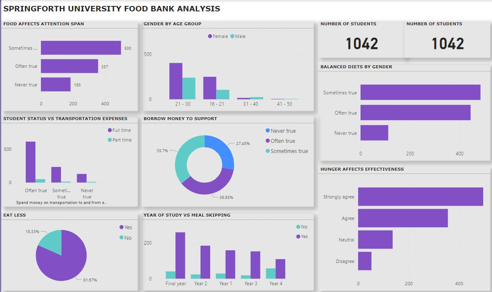

# Springforth University Foodbank Analysis

## Introduction

This is a project about Springforth University’s plan to set up a foodbank in the University in collaboration with United Nations Educational, Scientific and Cultural Organization (UNESCO). I cleaned and analyzed the data using PowerBi desktop and provided insights and recommendation to help the University makes informed decision on the need to set up the foodbank to be sponsored by UNESCO.

For this project, I took the role of a BI analyst by analyzing the students’ responses on the survey carried out by the University on the need to set up a foodbank in the University and I offered valuable insights to convince UNESCO to sponsor the foodbank project.

## Business Problem 
Springforth University (SpU) is planning to set up a foodbank on campus in collaboration with United Nations Educational, Scientific and Cultural Organization (UNESCO). However, the university needs to provide empirical reasons why the foodbank should be sponsored by UNESCO. This necessitated the university to carry out a survey among the students on food insecurity and academic performance.

## This is the dashboard for the analysis 

